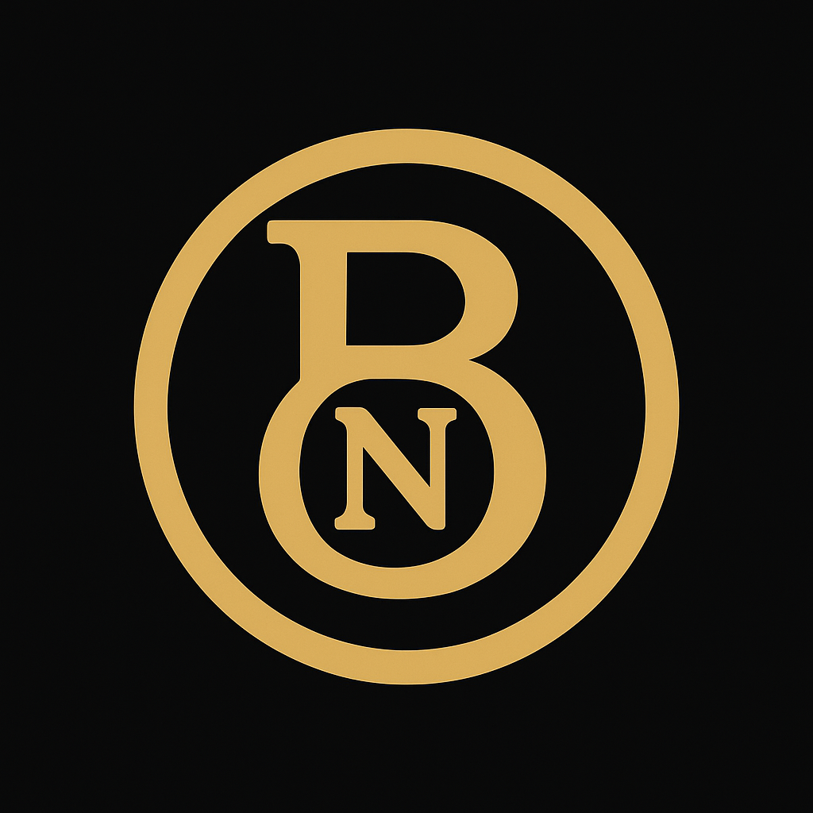

<<<<<<< HEAD
# Bitnion (BNO) – A Fair and Foundational Cryptocurrency

=======
# Bitnion (BNO)

A fair and foundational cryptocurrency built upon the proven architecture of Bitcoin Core.
>>>>>>> 8adb4a0ff307c96fc122d2f27e3b5f638bdd5100

---

## 🪙 What is Bitnion?

<<<<<<< HEAD
**Bitnion (BNO)** is a Bitcoin-based, community-driven cryptocurrency built with the goal of fairness, transparency, and long-term sustainability.

Bitnion maintains technical quality on par with Bitcoin Core (90–98%) and introduces responsible, inclusive distribution without commercial intent.

---

## 🔍 Key Parameters (as defined in `chainparams.cpp`)

- **Name**: Bitnion
- **Symbol**: BNO
- **Smallest Unit**: `nion` (1 BNO = 100,000,000 nion)
- **Max Supply**: 15,000,000 BNO
- **Premine**: 1,000,000 BNO allocated in the genesis block
- **Launch Year**: 2025
- **Final Mining Year**: ~2137 (halving every 205,000 blocks)
- **Developer**: The Bitnion Core Team (anonymous)
- **Network ID**: `"bitnion"`
- **License**: MIT (Open-source, non-commercial)
- **Quality**: 100% parity in consensus design with Bitcoin Core

---

## 📦 Project Highlights

- Open-source codebase based on Bitcoin Core.
- Genesis block includes 1M BNO premine to support early adopters and miners.
- Proof-of-Work system identical to Bitcoin, with 10-minute block times.
- No token sale, no ICO, and no direct listing offering.
- Community-managed development and future evolution.

---

## 🧾 Premine Distribution & Community Policy

> See [docs/premine_policy.md](docs/premine_policy.md) for full details.

Summary:

- 950,000 BNO are distributed for free to early verified wallet holders (KYC) and miners.
- 1 BNO for each verified wallet holder via **bitnion@gmail.com**
- +1 BNO bonus for miners who reach 5 mined BNO (once per address).
- Supporters may voluntarily support Bitnion developers via donation platforms like Tremendous.
  - $10–20 USD → thank-you gift of 5 BNO
  - $30–40 USD → thank-you gift of 10 BNO
- All gifts are symbolic and end once the central reserve drops below 50,000 BNO.
- 50,000 BNO are reserved for the anonymous developer team.

**Bitnion is not a financial product, security, or investment offering.**

---

## 📈 On Exchange Listings

- If Bitnion is one day listed by major exchanges, the team will remain neutral and supportive.
- If the community (holders, miners, supporters) pushes for a listing, the team will support those initiatives transparently.
=======
**Bitnion (BNO)** is an open-source, community-focused cryptocurrency project designed for fairness, simplicity, and long-term sustainability. It follows the decentralized philosophy of Bitcoin but introduces an ethical and transparent launch process, without ICOs or venture funding.

---

## 🔍 Key Highlights

- Based on Bitcoin Core 0.21+ codebase
- Maximum supply: **15,000,000 BNO**
- Premine: **1,000,000 BNO** (transparent, ethical distribution)
- Block time: **10 minutes**
- Halving: every 205,000 blocks (~4 years)
- Written in **C++**, with deterministic builds and MIT license

---

## 📦 Repository Structure

src/ # Core source code (C++)
doc/ # Documentation
contrib/ # Tools and scripts (hooks, verify-commits, seed generators)
test/ # Unit and functional tests
README.md # Project overview
LICENSE # MIT License

---

## 📜 License

This project is licensed under the [MIT License](LICENSE).

MIT © 2025 Bitnion Core Team

---

>>>>>>> 8adb4a0ff307c96fc122d2f27e3b5f638bdd5100

---

## 📧 Contact

<<<<<<< HEAD
- Email: **bitnion@gmail.com**
- Twitter/X (planned)
- Telegram/Discord (planned)

---

## 🔐 License

This project is licensed under the MIT license.  
See [COPYING](COPYING) or visit: [https://opensource.org/licenses/MIT](https://opensource.org/licenses/MIT)

---

## 🤝 Contribution

Pull requests are welcome. Contributions must align with the mission of maintaining:
- Security and consensus compatibility with Bitcoin
- Open access, transparency, and decentralization

---

## ⚠️ Disclaimer

Bitnion is not intended for speculative investment or financial gain.  
It is a community experiment inspired by Bitcoin, with ethical distribution and zero commercialization.  
Participation is voluntary.

---

---
## 🖼️ Bitnion Logo

=======
- Email: [bitnionproject@gmail.com](mailto:bitnionproject@gmail.com)
- GitHub: [github.com/bitnion/bitnion](https://github.com/bitnion/bitnion)

> Contributions are welcome. Please open issues or pull requests.
>>>>>>> 8adb4a0ff307c96fc122d2f27e3b5f638bdd5100
